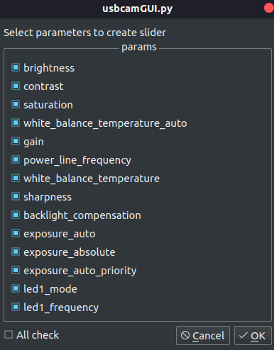
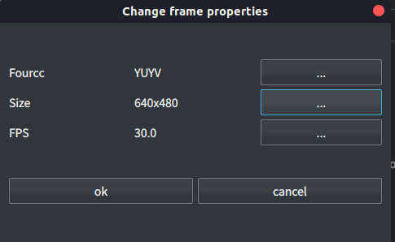

usbcamGUI
=======

usbcamGUI is simple GUI python script for Debian-based distributions, providing the capture of image, set parameters interactively with the USB camera.


# Install
The program is single python script so that you just clone the repository in your local machine by `git clone`. 
```bash
git clone https://github.com/git-ogawa/usbcamGUI.git
```
However, you need install the dependent packages. If you haven't installed the packages in requirements yet, can install them with pip
```bash
pip install git+https://github.com/git-ogawa/usbcamGUI
```

## Install on Raspberry Pi
The error message will be shown by executing `pip install git+https://github.com/git-ogawa/usbcamGUI`: `No matching distribution found for PySide2>=5.12.0 (from usbcamGUI==1.0.0)`. Apparently `Pyside2` cannot be installed with pip on Raspberry pi OS, so install with apt by the following command
```bash
sudo apt install python3-pyside2.qt3dcore python3-pyside2.qt3dinput python3-pyside2.qt3dlogic python3-pyside2.qt3drender python3-pyside2.qtcharts python3-pyside2.qtconcurrent python3-pyside2.qtcore python3-pyside2.qtgui python3-pyside2.qthelp python3-pyside2.qtlocation python3-pyside2.qtmultimedia python3-pyside2.qtmultimediawidgets python3-pyside2.qtnetwork python3-pyside2.qtopengl python3-pyside2.qtpositioning python3-pyside2.qtprintsupport python3-pyside2.qtqml python3-pyside2.qtquick python3-pyside2.qtquickwidgets python3-pyside2.qtscript python3-pyside2.qtscripttools python3-pyside2.qtsensors python3-pyside2.qtsql python3-pyside2.qtsvg python3-pyside2.qttest python3-pyside2.qttexttospeech python3-pyside2.qtuitools python3-pyside2.qtwebchannel python3-pyside2.qtwebsockets python3-pyside2.qtwidgets python3-pyside2.qtx11extras python3-pyside2.qtxml python3-pyside2.qtxmlpatterns python3-pyside2uic
```

## Requirements
The propgram requires `python >= 3.6`. The list of dependent packages is below. 

- numpy
- pillow
- PySide2
- Opencv >= 4.1.0

It also needs `v4l2` library to get lists of camera-supported information. If you haven't install yet, install with apt.
```bash
sudo apt install v4l-util
```

# Support

## OS
The Debian-based distributions below are supported.

- ubuntu 18.04 LTS
- Raspberry Pi OS (32bit)
- Windows 10 (partially supported, in development)

## Camera
I verified with cameras listed below. `Raspberry Pi Camera module V2` on Raspberry Pi is also supported because it can be treated as a USB device with opencv.

- Logicool C270


# Usage
Connect a usb camera to PC, then start GUI by executing `usbcamGUI/linux/usbcamGUI.py`
```
python usbcamGUI.py
```

## Save frame
Press the `Save` button on the top or `Ctrl + s` to save frame displayed on the window. The image is saved as png and the suffix can be changed by `-p <suffix>` option (for example, `python usbcamGUI -p jpg`). The following suffixes will be acceptable.
- png
- jpg
- pgm
- tiff


The filename is determined by the `Naming style` flag. While determined automatically in Sequantial and Timestamp mode, user can choose any filename in Manual mode. Press the `Naming style` button or `Ctrl + n` to switch the next flag.

| style | example             |
| ---------- | :-----------------: |
| Sequential | 00000.png           |
| Timestamp  | [yymmdd-HHMMSS].png |
| Manual     | any                 |


The csv file that contain the parameters when save the image is also made at the same time. In the file, each parameter is listed in the format: `[param],[value]`


## Change parameters
The label, slider and value on the right of the window shows each adjustable parameter supported by camera. You can drag the slider to change its value. Whether the specified parameter is valid strongly depends on what camera you use. 


### change paramters shown on the window
Click Choose parameter sliders in View tab or `Ctrl + g` to see the list of parameters supported by camera. Check the items you want to set and click ok to reconstruct the layout contain the sliders of the selected parameters.




## Change image size and FPS
Pressing the `Properties` button calls a dialog box to change image size and FPS. Select fourcc, size and fps you want to set, then click ok to apply the values.




## Switch theme
To switch the GUI color-theme, Press `Light/Dark` button above the view area or `ctrl + t`. The dark theme is set by default. The files for setting style are quoted from [Alexhuszagh/BreezeStyleSheets](https://github.com/Alexhuszagh/BreezeStyleSheets)


## Execute on Raspberry Pi
Executing `usbcamGUI/linux/usbcamGUI.py` with `-c raspi` option is recommended due to the adjustment of window layout and parameters.

```bash
python usbcamGUI.py -c raspi
```


## Execute on windows
Use `usbcamGUI/windows/usbcamGUI.py` instead of `usbcamGUI/linux/usbcamGUI.py`. Note that
- In many case, the device number 0 is connected to the internal camera. To use usb camera connected as external device, specify the device number 1 by the following (when one camera is connected to PC).
```bash
python usbcamGUI/py -d 1
```

- The number of adjustable parameters is set to minumum. I don't know how to extract the camera-supported information (parameters and its min, max, step and so on) on windows machine. If anyone knows how to get that, please tell me about the information.


## Arguments
Users can execute the program with options
```
python usbcamGUI.py <option> <value>
```
The list of acceptable options is as follows, which is also shown `python usbcamGUI.py -h`

| Option | Description | Default | example |
| :--: | :--: | :--: | :--: |
| -c | The kind of connected camera | usb_cam | -c usb_cam |
| -d | Device index of the connected camera ( /dev/video\<index> ) | 0 | -d 1 |
| --dir | A directory where the saved image and video are stored  | . | --dir image_dir |
| -e | Extension of the image to save | png | -e pgm |
| -col | Colorspace (color or gray) | rgb | -col gray |
| -s | Show a list of width, height, fourcc and FPS supported by camera. | False | -s |
| -sa | Show a list of format supported by camera. This is output of v4l2-ctl command | False | -sa |
| -sp | Show a list of parameters supported by camera. This is output of v4l2-ctl command | False | -sp |


# Troubleshooting

## libEGL warning: DRI2: failed to authenticate
This error message may be shown when use on Raspberry Pi. Linking the libraries `libEGL*`, `libEGL*` to full path may solve the error.
```bash
sudo ln -fs /opt/vc/lib/libGLESv2.so /usr/lib/arm-linux-gnueabihf/libGLESv2.so
sudo ln -fs /usr/lib/arm-linux-gnueabihf/libGLESv2.so.2 /usr/lib/arm-linux-gnueabihf/libGLESv2.so
sudo ln -fs /opt/vc/lib/libEGL.so /usr/lib/arm-linux-gnueabihf/libEGL.so
sudo ln -fs /usr/lib/arm-linux-gnueabihf/libEGL.so /usr/lib/arm-linux-gnueabihf/libEGL.so.1
```
Refer to the link https://raspberrypi.stackexchange.com/questions/61078/qt-applications-dont-work-due-to-libegl


## qt5ct: using qt5ct plugin
This is not error message and no effect for operation. If you want to suppress it, set the enviroment varibale below.
```bash
export QT_LOGGING_RULES="qt5ct.debug=false"
```

## `[Error] Input parameter is invalid !`  
This message is shown when the specified parameter is invalid. The reasons are mainly two. One is that a camera you use does not support change of the parameter. The other is that you need to set flag before changing the parameter. 

For logicool c270, the change of `exposure_absolute` doesn't work when `exposure_auto` is set to Aperture Priority mode. Turning mode to manual allow users to change the value of `exposure_absolute`. Therefore, you should try to adjust other parameters related to the specified ones.


# Change log
- version 1.1.0
    - can change font size with combox 
    - can change the number of sliders interactively

- version 1.0.0

