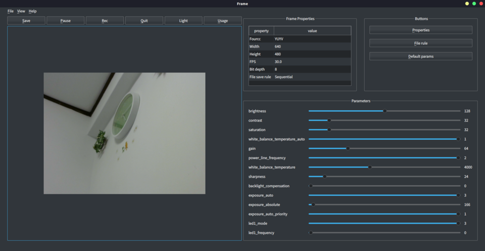
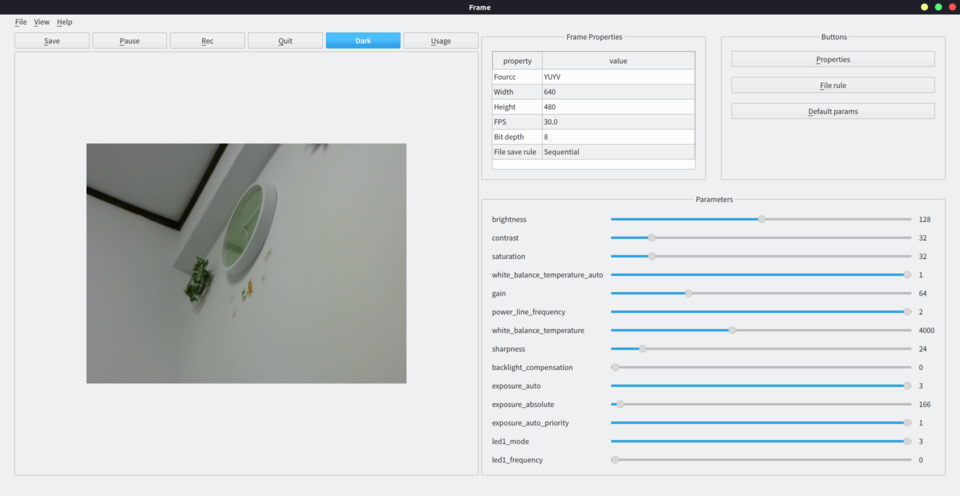

usbcamGUI
=======

usbcamGUI is simple GUI python scripts for Debian-based distributions, providing the capture of image from the USB camera, set the cam properties interactively.


# Install
It doee not need install the program so that you just clone the repository in your local machine by `git clone`. However, you need install the dependent packages in requirements. If you don't install yet, can install them by `pip install git+https://github.com/git-ogawa/usbcamGUI`

```bash
git clone https://github.com/git-ogawa/usbcamGUI.git
pip install git+https://github.com/git-ogawa/usbcamGUI
```

## Install to Raspberry Pi
Apperntly `Pyside2` cannot be installed with pip on Raspberry pi OS, so install with apt by the following command after showing the error message `No matching distribution found for PySide2>=5.12.0 (from usbcamGUI==1.0.0)` by `pip install git+https://github.com/git-ogawa/usbcamGUI`
```bash
sudo apt install python3-pyside2.qt3dcore python3-pyside2.qt3dinput python3-pyside2.qt3dlogic python3-pyside2.qt3drender python3-pyside2.qtcharts python3-pyside2.qtconcurrent python3-pyside2.qtcore python3-pyside2.qtgui python3-pyside2.qthelp python3-pyside2.qtlocation python3-pyside2.qtmultimedia python3-pyside2.qtmultimediawidgets python3-pyside2.qtnetwork python3-pyside2.qtopengl python3-pyside2.qtpositioning python3-pyside2.qtprintsupport python3-pyside2.qtqml python3-pyside2.qtquick python3-pyside2.qtquickwidgets python3-pyside2.qtscript python3-pyside2.qtscripttools python3-pyside2.qtsensors python3-pyside2.qtsql python3-pyside2.qtsvg python3-pyside2.qttest python3-pyside2.qttexttospeech python3-pyside2.qtuitools python3-pyside2.qtwebchannel python3-pyside2.qtwebsockets python3-pyside2.qtwidgets python3-pyside2.qtx11extras python3-pyside2.qtxml python3-pyside2.qtxmlpatterns python3-pyside2uic
```

## Requirements
The propgram requires `python >= 3.6`. The list of dependent packages is below. 

- numpy
- pillow
- PySide2
- Opencv >= 4.1.0

It also needs `v4l2` library to get lists of camera-supported information. If you does not install yet, install wtih apt.
```bash
sudo apt install v4l-util
```

# Support

## OS
The Debian-based distributions are supported.

- ubuntu 18.04 LTS
- Raspberry Pi OS (32bit)
- Windows 10 (partially supported, in development)

## Camera
I verified with cameras listed below. `Raspberry Pi Camera module V2`with Raspberry Pi is also supprted because it can be treated as a USB device with opencv.

- Logicool C270


# Usage
Connect a usb camera to PC, then start GUI by executing `usbcamGUI/linux/usbcamGUI.py`
```
python usbcamGUI.py
```

## Save the frame
Press the `Save` button on the top or `Ctrl + s` to save the frame on the window. Deaults to as a `png` Can change the format by executing with `-p <extension>` option . `png`, `jpg`, `tiff`, `pgm` are supproted.


## Change parameters
The label, silder and value on the right of the window shows each adjustable parameter supported by camera. You can drag the slider to change its value.


Whether the specified parameter is valid strongly depends on what camera you use. 


## Change image size and FPS
Press the `Size` button or `Ctrl + h` calls a dialog box to change image size and FPS.


## Switch theme
To switch the GUI color-theme, Press toggle button above the frame window or `ctrl + t`. The dark theme is set by default.


 


## Execute on windows
Use `usbcamGUI/windows/usbcamGUI.py` instead of `linux`. I don't know the If anyone knows how to get list of the camera supported properties (min, max, step and so on), Tell me about the information.


## Arguments

You can specify the options
```
python usbcamGUI.py <option> <value>
```

The list are also shown by `python usbcamGUI.py -h`

| Option | Description | Default | example |
| :--: | :--: | :--: | :--: |
| -c | The kind of connected camera | usb_cam | -c usb_cam |
| -d | Device index of the connected camera ( /dev/video\<index> ) | 0 | -d 1 |
| --dir | A directory where the saved image and video are stored  | . | --dir image_dir |
| -e | Extension of the image to save | png | -e pgm |
| -col | Colorspace (color or gray) | rgb | -col gray |
| -s | Show a list of width, height, fourcc and FPS supported by camera. | False | -s |
| -sa | Show a list of format supported by camera. This is output of v4l2-ctl command | False | -sa |
| -sp | Show a list of parameters supported by camera. This is output of v4l2-ctl command | False | -sp |


# Troubleshooting

## libEGL warning: DRI2: failed to authenticate
If you execute the program on Raspberry Pi, this error message may be shown. The libraries `libEGL*`, `libEGL*` link to full path so that the error may be solved.
```
sudo ln -fs /opt/vc/lib/libGLESv2.so /usr/lib/arm-linux-gnueabihf/libGLESv2.so
sudo ln -fs /usr/lib/arm-linux-gnueabihf/libGLESv2.so.2 /usr/lib/arm-linux-gnueabihf/libGLESv2.so
sudo ln -fs /opt/vc/lib/libEGL.so /usr/lib/arm-linux-gnueabihf/libEGL.so
sudo ln -fs /usr/lib/arm-linux-gnueabihf/libEGL.so /usr/lib/arm-linux-gnueabihf/libEGL.so.1
```
Refer to the link https://raspberrypi.stackexchange.com/questions/61078/qt-applications-dont-work-due-to-libegl


## qt5ct: using qt5ct plugin
This is not error message and no effect for operation. If you want to suppress it, set the enviroment varibale below.
```bash
export QT_LOGGING_RULES="qt5ct.debug=false"
```

## `[Error] Input parameter is invalid !`  
This message is shown when the value is invalid. A camera does not support the specified property. or for example, the change of exposure_absolute does not work when exposure_auto set Aperture Priority mode. Turning mode to manual allow users to change the value of exposure_auto. Therefore, you try to adjust other parameters related to the specified parameter.


# Change log
- version 1.0.0